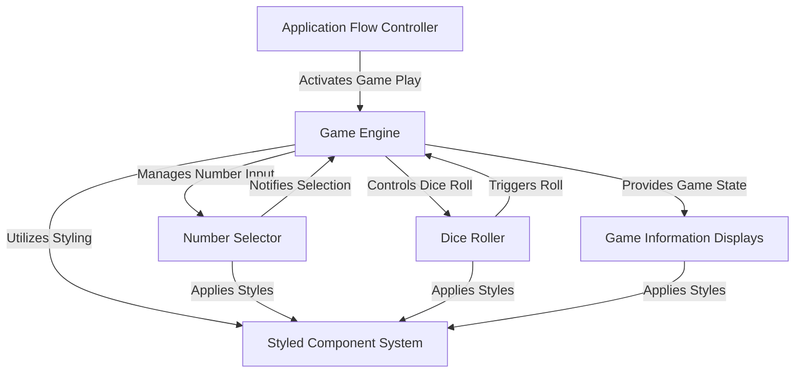
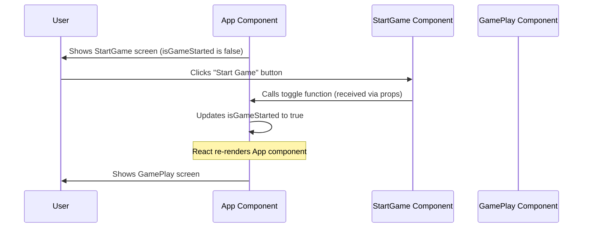
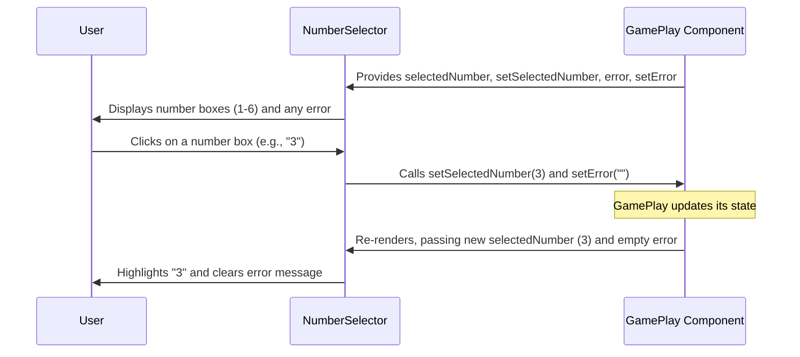
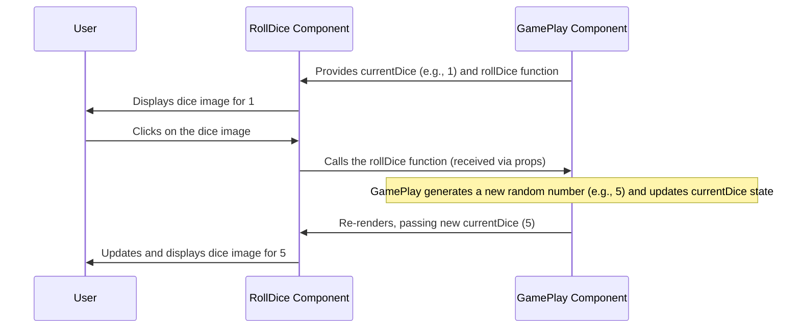
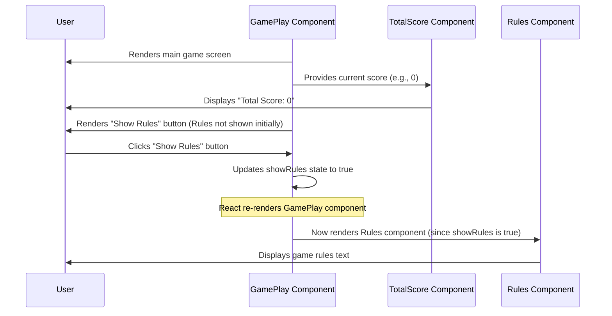
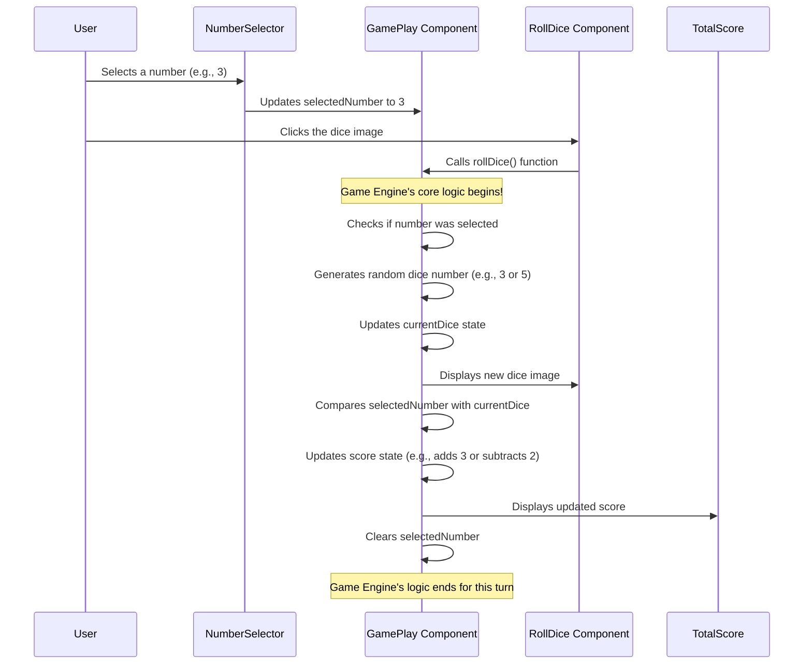

# Tutorial: Dice Game

This project is a *simple and interactive* **Dice Game** built with React. Players first select a number they predict the dice will land on, then **roll the dice**. Their score is dynamically updated based on whether their guess was correct, increasing for a match and decreasing for a mismatch. The application includes a clear **start screen**, a *real-time scoreboard*, and *easy-to-understand game rules*.


## Visual Overview



## Chapters

1. [Application Flow Controller
](01_application_flow_controller_.md)
2. [Number Selector
](02_number_selector_.md)
3. [Dice Roller
](03_dice_roller_.md)
4. [Game Information Displays
](04_game_information_displays_.md)
5. [Game Engine
](05_game_engine_.md)
6. [Styled Component System
](06_styled_component_system_.md)

# Chapter 1: Application Flow Controller

Welcome to the exciting world of building interactive applications with React! In this first chapter, we're going to tackle a fundamental concept: how your application decides what to show to the user at any given moment. Think of it like a movie director guiding the audience through different scenes.

### The Big Picture: Directing Your App's Flow

Imagine you're building a simple dice game. When a user first opens your game, what do they see? Probably a "Welcome" screen with a "Start Game" button, right? Once they click that button, they should then see the actual game interface with dice and scores.

How does your React application know when to switch from the "Welcome" screen to the "Game Play" screen? This is exactly what the "Application Flow Controller" is all about! It's the brain that decides which major part of your application is currently active and visible. It acts like a gatekeeper, guiding the user to either the waiting area or the main event hall once they're ready to begin.

### How it Works: State and Conditional Showing

In React, we use something called "state" to remember information that can change over time. For our game, we need to remember if the game has started or not. We can use a simple `true` or `false` value for this.

Let's look at the main part of our application, usually found in a file called `App.jsx`. This is where our "director" lives.

```jsx
// Dice_Game/src/App.jsx
import { useState } from "react";
import StartGame from "./components/StartGame";
import GamePlay from "./components/GamePlay";

function App() {
  // 1. We remember if the game has started
  const [isGameStarted, setIsGameStarted] = useState(false);

  // 2. A function to switch between "started" and "not started"
  const toggleGamePlay = () => {
    setIsGameStarted((prev) => !prev);
  };

  // 3. We decide what to show based on 'isGameStarted'
  return (
    <>
      {
        isGameStarted ? <GamePlay/> : <StartGame toggle={toggleGamePlay}/>
      }
    </>
  );
}

export default App;
```

Let's break down this code:

1.  **`useState(false)`**: This is how React helps us "remember" things. We create a variable called `isGameStarted`, and its starting value is `false` (meaning the game has *not* started yet). `setIsGameStarted` is a special function React gives us to change the value of `isGameStarted`.

    ```jsx
    const [isGameStarted, setIsGameStarted] = useState(false);
    ```

    *   **`isGameStarted`**: This holds the current state (`true` or `false`).
    *   **`setIsGameStarted`**: This is the function you call to *change* the state.
    *   **`useState(false)`**: `false` is the initial value when the app first loads.

2.  **`toggleGamePlay` Function**: This is a simple function that flips the `isGameStarted` value. If it was `false`, it becomes `true`, and vice-versa. We use `(prev) => !prev` to safely get the previous value and then flip it.

    ```jsx
    const toggleGamePlay = () => {
      setIsGameStarted((prev) => !prev); // Flips true to false, false to true
    };
    ```

    When this function is called, React will see that `isGameStarted` has changed, and it will re-run the `App` function to update what's shown on the screen.

3.  **Conditional Showing (`? :`)**: This is the magic line that acts as our director. It's like saying: "If `isGameStarted` is true, show the `<GamePlay/>` component. Otherwise (if it's false), show the `<StartGame toggle={toggleGamePlay}/>` component."

    ```jsx
    {
      isGameStarted ? <GamePlay/> : <StartGame  toggle={toggleGamePlay}/>
    }
    ```

    *   `<GamePlay/>`: This is a placeholder for your actual game screen.
    *   `<StartGame toggle={toggleGamePlay}/>`: This is a placeholder for your welcome screen. Notice how we pass our `toggleGamePlay` function down to the `StartGame` component. This is important! The "Start Game" button lives inside `StartGame`, and it needs a way to tell `App` that it's time to switch screens. Passing functions down like this is a very common React pattern called "props".

### How the Flow Happens: Step-by-Step

Let's trace what happens when the user interacts with the app:



1.  **Start Up**: When the app first loads (thanks to `main.jsx` which tells React to put `App` on the screen), the `App` component runs. `isGameStarted` is `false`. So, the `StartGame` component is shown to the user.
2.  **User Action**: The user sees the `StartGame` screen and clicks a button (e.g., "Start Game").
3.  **Calling the Director**: The `StartGame` component, which received the `toggleGamePlay` function as a `prop` (we named it `toggle` inside `StartGame`), calls that function.

    Here's a simplified look at how `StartGame` might use the `toggle` prop:

    ```jsx
    // Dice_Game/src/components/StartGame.jsx (simplified)
    function StartGame({ toggle }) { // 'toggle' is the prop received
      return (
        <div>
          <h1>Welcome to the Dice Game!</h1>
          <button onClick={toggle}>Start Game</button> {/* This calls the toggle function */}
        </div>
      );
    }
    export default StartGame;
    ```

4.  **State Update**: When `toggleGamePlay` is called, `setIsGameStarted((prev) => !prev)` runs in `App.jsx`. This flips `isGameStarted` from `false` to `true`.
5.  **Re-render**: Because `isGameStarted` changed, React knows it needs to update the `App` component. It runs the `App` function again.
6.  **New Screen**: This time, `isGameStarted` is `true`. So, the conditional rendering `isGameStarted ? <GamePlay/> : <StartGame toggle={toggleGamePlay}/>` now evaluates to `<GamePlay/>`. The `StartGame` component disappears, and the `GamePlay` component takes its place on the screen!

This simple `useState` and conditional rendering pattern is the backbone of controlling what your user sees in a React application. It's like flipping a light switch to turn on a different room!

### Conclusion

You've just learned about the "Application Flow Controller," which is essentially how your main `App` component acts as the director, using `useState` to keep track of important information (like `isGameStarted`) and then using conditional rendering (`? :`) to decide which major screen or component to show. You also saw how child components (like `StartGame`) can communicate back to the parent `App` by calling functions passed down as "props."

In the next chapter, we'll dive into the [Number Selector](02_number_selector_.md) component, which will be an important part of our `GamePlay` screen, allowing players to choose numbers for their turns.


# Chapter 2: Number Selector

Welcome back! In [Chapter 1: Application Flow Controller](01_application_flow_controller_.md), we learned how your React application acts like a director, deciding which big "scene" (like the "Start Game" screen or the "Game Play" screen) to show based on whether the game has started.

Now that our "director" knows when to show the `GamePlay` screen, let's zoom in on a crucial part *within* that screen: how the player chooses their number before rolling the dice. Imagine you're playing a dice game, and you want to predict what number will come up. Before you roll, you need a way to **select your prediction**. This is exactly what the "Number Selector" component does!

### What is the Number Selector?

The **Number Selector** is like a digital betting slip or a set of buttons from 1 to 6. Its main job is to:

1.  **Display** numbers from 1 to 6.
2.  Allow the player to **click** and choose one of these numbers.
3.  **Visually highlight** the chosen number so the player knows what they've picked.
4.  Optionally, show a helpful **error message** if the player tries to do something important (like roll the dice) without picking a number first.

It's a small but very important piece of our game's interface!

### How Do We Build This? Key Ideas

To make our Number Selector work, we need a few key ingredients:

*   **"Remembering" the Chosen Number:** Just like our `App` component remembered if the game started (`isGameStarted`), our `GamePlay` screen needs to remember *which number* the player has selected. We'll use `useState` for this again!
*   **Displaying the Numbers:** We'll use a programming trick to easily show boxes for numbers 1 through 6 without writing `Box` components six times.
*   **Reacting to Clicks:** When a player clicks a number, we need to update our "remembered" chosen number.
*   **Communicating with the Game:** The Number Selector is a child component of our main `GamePlay` screen. It needs a way to tell its parent `GamePlay` *which number was chosen* and also to *clear any error messages* once a number is selected. We'll do this using `props` – just like we passed the `toggle` function to `StartGame` in the last chapter!

### Using the Number Selector Component

First, let's see how our main `GamePlay` component (which is shown when `isGameStarted` is true) will use our new `NumberSelector`.

Inside `GamePlay`, we'll need to create two pieces of `state`: one to hold the `selectedNumber` (the player's choice) and another for any `error` messages.

```jsx
// Dice_Game/src/components/GamePlay.jsx (simplified)
import { useState } from "react";
import NumberSelector from "./NumberSelector"; // We'll create this file!

function GamePlay() {
  // 1. We remember the number the player selected (starts empty)
  const [selectedNumber, setSelectedNumber] = useState();

  // 2. We remember if there's any error message to show
  const [error, setError] = useState("");

  // ... other game logic will go here later

  return (
    <div>
      {/* Our Number Selector component! */}
      {/* We pass our 'state' values and their 'set' functions as props */}
      <NumberSelector
        setError={setError}
        error={error}
        selectedNumber={selectedNumber}
        setSelectedNumber={setSelectedNumber}
      />
      {/* More game components will be added here later */}
    </div>
  );
}

export default GamePlay;
```

**Explanation:**

*   **`useState()` for `selectedNumber` and `error`**: Just like `isGameStarted` in `App.jsx`, these `useState` calls tell React to "remember" the player's chosen number (or lack thereof) and any current error message. They start out empty or undefined.
*   **`<NumberSelector ... />`**: This is where we use our new component. We pass the `selectedNumber` and `error` (the values) *down* to the `NumberSelector`. More importantly, we also pass the `setSelectedNumber` and `setError` (the functions that *change* the state) *down* as well. This allows the `NumberSelector` component to update the `selectedNumber` and `error` in its parent, `GamePlay`.

This setup is crucial because the `GamePlay` component needs to know what number was selected so it can tell the [Game Engine](05_game_engine_.md) (which we'll cover later) when the player rolls the dice.

### Inside the Number Selector: How it Works

Now, let's look at what goes on *inside* the `NumberSelector` component itself.

#### Step-by-Step Flow

When you use the Number Selector:



1.  **Numbers to Display**: The `NumberSelector` starts with a simple list of numbers: `[1, 2, 3, 4, 5, 6]`.
2.  **Drawing the Boxes**: For each number in this list, the `NumberSelector` draws a `Box` on the screen.
3.  **Clicking a Box**: When the player clicks on one of these `Box`es:
    *   The `NumberSelector`'s internal `numberSelectorHandler` function is activated, receiving the clicked number (e.g., `3`).
    *   This function then uses `setSelectedNumber(3)` (which was passed from `GamePlay`) to tell the `GamePlay` component that `3` is now the chosen number.
    *   It also calls `setError("")` (also from `GamePlay`) to clear any old error messages, because the player has now made a valid selection.
4.  **Visual Update**: Because `setSelectedNumber` updated the state in `GamePlay`, React automatically re-runs `GamePlay`, which then re-runs `NumberSelector` with the *new* `selectedNumber` (which is now `3`). The `Box` component for number `3` will now detect that `isSelected` is `true` for itself and change its colors to stand out!
5.  **Error Messages**: If the `error` prop (passed from `GamePlay`) contains text, it's displayed. Otherwise, it's hidden.

#### Code Details (`NumberSelector.jsx`)

Let's break down the code for `Dice_Game/src/components/NumberSelector.jsx`.

**1. Receiving Props:**

```jsx
// Dice_Game/src/components/NumberSelector.jsx
import { useState } from "react"; // Not directly used in NumberSelector itself, but often useful
import styled from "styled-components"; // For styling, covered in Chapter 6

const NumberSelector = ({setError, error, selectedNumber, setSelectedNumber}) => {
    // ... component code
};

export default NumberSelector;
```

**Explanation:** The `NumberSelector` function receives its "marching orders" from its parent (`GamePlay`) through an object called `props`. We've "destructured" these props, which is a fancy way of saying we've pulled out `setError`, `error`, `selectedNumber`, and `setSelectedNumber` directly.

**2. The List of Numbers:**

```jsx
// Dice_Game/src/components/NumberSelector.jsx (inside NumberSelector component)
const NumberSelector = ({setError, error, selectedNumber, setSelectedNumber}) => {
    const arrNumber = [1, 2, 3, 4, 5, 6]; // Our numbers from 1 to 6
    // ... rest of component
};
```

**Explanation:** We create a simple array `arrNumber` that holds the numbers we want to display. This is much cleaner than writing out `Box` components for each number manually.

**3. Handling Clicks:**

```jsx
// Dice_Game/src/components/NumberSelector.jsx (inside NumberSelector component)
const NumberSelector = ({setError, error, selectedNumber, setSelectedNumber}) => {
    const arrNumber = [1, 2, 3, 4, 5, 6];

    const numberSelectorHandler = (value) => {
        setSelectedNumber(value); // Tells GamePlay to update selected number
        setError(""); // Tells GamePlay to clear any error message
    };
    // ... rest of component
};
```

**Explanation:** This `numberSelectorHandler` function is called whenever a number box is clicked. It takes the `value` of the clicked box. It then uses the `setSelectedNumber` and `setError` functions (which came from `GamePlay`) to update the state in the parent component.

**4. Displaying the Numbers and Error:**

```jsx
// Dice_Game/src/components/NumberSelector.jsx (inside NumberSelector component, in return)
return (
    <NumberSelectorContainer> {/* Our main container for styling */}
        <p className="error">{error}</p> {/* Display error message if it exists */}
        <div className="flex">
            {/* Loop through arrNumber to create a Box for each number */}
            {arrNumber.map((value, i) => (
                <Box
                    isSelected={value === selectedNumber} // Is this box the selected one?
                    key={i} // A unique key for React's internal use
                    onClick={() => numberSelectorHandler(value)} // What to do when clicked
                >
                    {value} {/* Display the number */}
                </Box>
            ))}
        </div>
        <p>Select Number</p>
    </NumberSelectorContainer>
);
```

**Explanation:**

*   **`<p className="error">{error}</p>`**: This line conditionally displays the `error` message. If `error` is an empty string, nothing will show. If `error` contains text (like "You must select a number!"), that text will appear.
*   **`arrNumber.map(...)`**: This is a powerful JavaScript trick! `map` goes through each `value` in `arrNumber` (1, then 2, then 3, etc.) and does something with it. In our case, for each `value`, it creates a `Box` component.
    *   **`isSelected={value === selectedNumber}`**: This is very important for the visual highlight. It checks if the current `value` (e.g., 3) is the same as the `selectedNumber` (which came from `GamePlay`). This `true` or `false` value is passed as a `prop` to the `Box` component.
    *   **`onClick={() => numberSelectorHandler(value)}`**: When a `Box` is clicked, this tells React to call our `numberSelectorHandler` function, passing the `value` of the clicked box.
*   **`<p>Select Number</p>`**: A simple instruction for the player.

**5. Styling with `styled-components`:**

Our boxes and container are visually appealing thanks to `styled-components`. While we'll dive deep into [Styled Component System](06_styled_component_system_.md) later, here's a peek at how `isSelected` helps styling:

```jsx
// Dice_Game/src/components/NumberSelector.jsx (at the bottom)
// ...
const Box = styled.div`
    height: 72px;
    width: 72px;
    border: 1px solid black;
    display: grid;
    place-items: center;
    font-size: 24px;
    font-weight: 700;
    cursor: pointer;
    background-color: ${(props) => props.isSelected ? "black" : "white"}; /* Magic line! */
    color: ${(props) => props.isSelected ? "white" : "black"}; /* More magic! */
`;
// ...
```

**Explanation:** This `Box` component is actually a styled `div` HTML element. The key part is `background-color` and `color`. The line `(props) => props.isSelected ? "black" : "white"` means: "Look at the `isSelected` prop. If it's `true`, make the background `black`. Otherwise, make it `white`." The `color` (text color) flips too, ensuring readability. This is how the selected number visually stands out!

### Conclusion

You've just built an interactive "Number Selector" component! You learned how to:

*   Use `useState` in a parent component (`GamePlay`) to remember which number is selected and if there's an error.
*   Pass state values and their updater functions as `props` down to a child component (`NumberSelector`) to allow the child to update the parent's state.
*   Dynamically render a list of items (our number boxes) using the `map` function.
*   Handle clicks on elements and update state based on user interaction.
*   Use `props` to conditionally apply styles, creating a visual highlight for the selected item.

This component is a fundamental building block for many interactive applications. In the next chapter, we'll roll into the [Dice Roller](03_dice_roller_.md) component, where we'll figure out how to simulate rolling a dice and display the result!


# Chapter 3: Dice Roller

Welcome back! In [Chapter 2: Number Selector](02_number_selector_.md), we built a way for players to choose their lucky number before a roll. But what's a dice game without actual dice? Now, it's time for the main event: rolling the dice and seeing what number comes up!

### The Digital Dice Cup: Rolling into Action

Imagine you have a real dice cup. You shake it, and then you tip it over to reveal the dice. In our game, we need a digital version of this. Our "Dice Roller" abstraction solves this problem by:

1.  **Showing a Dice Image:** It displays an image of a dice.
2.  **Listening for Clicks:** When the player *clicks* on this dice image, it's like shaking the digital dice cup.
3.  **Generating a New Number:** Behind the scenes, our game will generate a brand new random number (1 to 6).
4.  **Updating the Image:** The dice image then quickly changes to show the new random number, revealing the outcome of the roll!

It's a core part of the game's interaction, making the game feel alive and responsive.

### How Do We Build This? Key Ideas

To make our Dice Roller work, we'll need these concepts:

*   **"Remembering" the Current Dice Value:** Just like `GamePlay` remembered the `selectedNumber`, it needs to remember the `currentDice` value (e.g., 3, 5, 1). This is another job for `useState`!
*   **Generating Random Numbers:** We'll use a special JavaScript trick to pick a random number between 1 and 6.
*   **Responding to Clicks:** When the dice image is clicked, we'll trigger the random number generation and update.
*   **Displaying Dynamic Images:** The dice image file name will change based on the `currentDice` value.

### Using the Dice Roller Component

Our `Dice Roller` component is a child of the `GamePlay` screen, just like the `NumberSelector`. It needs to know what number to display (the `currentDice`) and it needs a way to tell `GamePlay` that it's been clicked so `GamePlay` can generate a new random number.

Let's see how our `GamePlay` component (from [Chapter 1: Application Flow Controller](01_application_flow_controller_.md)) will use our new `RollDice` component:

```jsx
// Dice_Game/src/components/GamePlay.jsx (simplified for this chapter)
import { useState } from "react";
import NumberSelector from "./NumberSelector";
import RollDice from "./RollDice"; // We'll create this file!

function GamePlay() {
  const [selectedNumber, setSelectedNumber] = useState();
  const [error, setError] = useState("");
  const [currentDice, setCurrentDice] = useState(1); // 1. New state for dice value

  // 2. Function to roll the dice
  const rollDice = () => {
    // We'll put the actual random number generation here!
    console.log("Dice Rolled!"); // For now, just a message
  };

  return (
    <div>
      <NumberSelector
        setError={setError}
        error={error}
        selectedNumber={selectedNumber}
        setSelectedNumber={setSelectedNumber}
      />
      {/* Our Dice Roller component! */}
      {/* We pass the current dice value and the roll function */}
      <RollDice currentDice={currentDice} rollDice={rollDice} />
      {/* ... more game components */}
    </div>
  );
}

export default GamePlay;
```

**Explanation:**

1.  **`const [currentDice, setCurrentDice] = useState(1);`**: We add a new piece of state to `GamePlay` to remember what number the dice is currently showing. We start it at `1` so there's an image to display when the game first loads.
2.  **`const rollDice = () => { ... };`**: This is the function that will actually *do* the rolling. For now, it just prints a message, but soon it will generate a random number and update `currentDice`.
3.  **`<RollDice currentDice={currentDice} rollDice={rollDice} />`**: This is how we use our `RollDice` component.
    *   We pass the `currentDice` value *down* to `RollDice` so it knows which image to show.
    *   We pass the `rollDice` function *down* as well. This allows the `RollDice` component (when clicked) to tell `GamePlay` to perform the actual roll!

### Inside the Dice Roller: How it Works

Let's trace what happens when a player rolls the dice:



1.  **Display Initial Dice**: When `GamePlay` first shows `RollDice`, `currentDice` is 1, so the `RollDice` component displays the dice image for "1".
2.  **User Clicks**: The user clicks on the dice image shown by `RollDice`.
3.  **Call Parent Function**: `RollDice` calls the `rollDice` function it received as a `prop` from `GamePlay`.
4.  **Generate New Number**: Inside `GamePlay`, the `rollDice` function runs. It calculates a new random number (say, 5) and uses `setCurrentDice(5)` to update its `currentDice` state.
5.  **Re-render**: Because `currentDice` changed in `GamePlay`, React automatically re-runs `GamePlay`, which then re-runs `RollDice` with the *new* `currentDice` value (which is now `5`).
6.  **Display New Dice**: The `RollDice` component sees that `currentDice` is now `5` and updates its image to show the dice for "5". The player sees the result!

#### Code Details (`RollDice.jsx`)

Let's look at the `Dice_Game/src/components/RollDice.jsx` file that we've already peeked at in the "Relevant Code Snippets" section.

**1. Receiving Props:**

```jsx
// Dice_Game/src/components/RollDice.jsx
import styled from "styled-components" // For styling, covered in Chapter 6

const RollDice = ({rollDice, currentDice}) => {
    // ... component code
};

export default RollDice;
```

**Explanation:** The `RollDice` component receives two `props` from its parent `GamePlay`: `rollDice` (the function to call when clicked) and `currentDice` (the number to display).

**2. Displaying the Dice and Handling Clicks:**

```jsx
// Dice_Game/src/components/RollDice.jsx (inside RollDice component, in return)
return (
    <DiceContainer> {/* Our main container for styling */}
        <div className="dice" onClick={rollDice}> {/* This is the clickable part! */}
            
        </div>
        <p>Click on Dice to Roll</p>
    </DiceContainer>
)
```

**Explanation:**

*   **`<div className="dice" onClick={rollDice}>`**: This `div` acts as the clickable area for our dice image. When it's clicked, it calls the `rollDice` function that was passed down as a prop from `GamePlay`.
*   **``**: This is the magic line that displays the correct dice image!
    *   We use something called a "template literal" (the backticks `` ` ``) to create the image path.
    *   `${currentDice}` means that the value of the `currentDice` variable will be inserted right there.
    *   So, if `currentDice` is `1`, the `src` becomes `./images/dice/dice_1.png`. If `currentDice` is `5`, it becomes `./images/dice/dice_5.png`. This is how the image changes dynamically!

#### Implementing the Roll Logic in `GamePlay`

Now let's go back to `GamePlay.jsx` and fill in the `rollDice` function to actually generate a random number and update the dice.

```jsx
// Dice_Game/src/components/GamePlay.jsx (updated snippet)
import { useState } from "react";
// ... other imports

function GamePlay() {
  const [currentDice, setCurrentDice] = useState(1);
  // ... other states

  const rollDice = () => {
    // Generate a random number between 1 and 6
    const randomNumber = Math.floor(Math.random() * 6) + 1;
    // Math.random() gives a number like 0.123, 0.987 (between 0 and 1)
    // * 6 makes it between 0 and 5.999
    // Math.floor() rounds it down to a whole number (0, 1, 2, 3, 4, 5)
    // + 1 shifts it to be between 1 and 6

    setCurrentDice(randomNumber); // Update the state with the new number
  };

  return (
    <div>
      {/* ... other components */}
      <RollDice currentDice={currentDice} rollDice={rollDice} />
    </div>
  );
}

export default GamePlay;
```

**Explanation:**

*   **`const randomNumber = Math.floor(Math.random() * 6) + 1;`**: This is the standard way to get a random integer in JavaScript.
    *   `Math.random()`: Gives a random decimal number between 0 (inclusive) and 1 (exclusive), like `0.345` or `0.992`.
    *   `* 6`: Multiplies that number by 6, so it becomes a number between 0 and 5.999... (e.g., `2.07` or `5.84`).
    *   `Math.floor()`: Rounds the number *down* to the nearest whole number (e.g., `2.07` becomes `2`, `5.84` becomes `5`). So now we have a whole number from 0 to 5.
    *   `+ 1`: Finally, we add `1` to shift the range from (0-5) to (1-6). Perfect for a dice!
*   **`setCurrentDice(randomNumber);`**: Once we have our `randomNumber`, we call `setCurrentDice` to update the state in `GamePlay`. As we saw, this will trigger `GamePlay` to re-render, and `RollDice` will receive the new `currentDice` value, updating its image.

### Conclusion

You've successfully built the "Dice Roller" component, bringing a key interactive element to our game! You learned how to:

*   Manage dynamic images by using state and string interpolation (`./images/dice/dice_${currentDice}.png`).
*   Generate random numbers in JavaScript.
*   Pass a function from a parent component (`GamePlay`) to a child component (`RollDice`) so the child can trigger actions in the parent.
*   Update state in the parent based on user interaction in a child component.

This is a powerful pattern for building interactive user interfaces. In the next chapter, we'll focus on the [Game Information Displays](04_game_information_displays_.md), showing the player's score and other important game details.


# Chapter 4: Game Information Displays

Welcome back! In [Chapter 3: Dice Roller](03_dice_roller_.md), we brought our dice to life, making them clickable and generating random numbers. Now that our game has interaction, players need to know what's happening. How many points do they have? What are the rules? This is where "Game Information Displays" come in!

### Keeping Players Informed: The Game's Dashboard

Imagine you're playing a board game. You need to know your score, and sometimes you need to quickly look up a rule. In our digital dice game, we need dedicated areas to show this vital information. This is exactly what our "Game Information Displays" components do.

We'll focus on two key components for this:

1.  **`TotalScore`**: This component acts like a dynamic scoreboard. It constantly updates to show the player's current points, always visible on the screen.
2.  **`Rules`**: This component provides a clear, on-demand explanation of how to play the game, including how points are gained or lost. It's like the instruction manual, readily available when needed.

Together, they make sure the player is always aware of their progress and how the game works.

### How Do We Build This? Key Ideas

To create these information displays, we'll use a few simple React concepts:

*   **`TotalScore`**: This component needs to **receive** the current score from its parent component (`GamePlay`). It doesn't change the score itself, just displays it. This is a perfect job for "props" (properties passed from parent to child).
*   **`Rules`**: This component simply displays static text (the game rules). It doesn't need any special information from its parent. We will show it conditionally, meaning it only appears when the player wants to see it.
*   **Conditional Rendering**: Just like we showed either `StartGame` or `GamePlay` in [Chapter 1: Application Flow Controller](01_application_flow_controller_.md), we can conditionally show or hide the `Rules` component based on a state variable in `GamePlay`.

### Using the Game Information Displays

Let's see how our main `GamePlay` component will incorporate these new information displays. `GamePlay` will be responsible for:

1.  Keeping track of the `score` (using `useState`).
2.  Keeping track of whether the `Rules` should be `showRules` or `hideRules` (using another `useState`).
3.  Passing the `score` to the `TotalScore` component.
4.  Conditionally rendering the `Rules` component.

```jsx
// Dice_Game/src/components/GamePlay.jsx (simplified for this chapter)
import { useState } from "react";
import TotalScore from "./TotalScore"; // New import
import Rules from "./Rules"; // New import

function GamePlay() {
  const [score, setScore] = useState(0); // 1. New state for the player's score
  const [showRules, setShowRules] = useState(false); // 2. State to show/hide rules

  // 3. Function to toggle (flip) the showRules state
  const toggleRulesDisplay = () => {
    setShowRules((prev) => !prev); // Flips true to false, false to true
  };

  return (
    <div>
      {/* Our score display! */}
      <TotalScore score={score} /> {/* Pass the score to TotalScore */}

      {/* Button to show/hide rules */}
      <button onClick={toggleRulesDisplay}>
        {showRules ? "Hide" : "Show"} Rules
      </button>

      {/* Conditionally display Rules component */}
      {showRules && <Rules />} {/* ONLY shows if showRules is true */}

      {/* ... other game components like NumberSelector and RollDice will be here */}
    </div>
  );
}

export default GamePlay;
```

**Explanation:**

1.  **`const [score, setScore] = useState(0);`**: We add a new `score` state variable to `GamePlay`. It starts at `0`. `setScore` will be used later (in [Chapter 5: Game Engine](05_game_engine_.md)) to update this value when the player rolls.
2.  **`const [showRules, setShowRules] = useState(false);`**: This new state variable, `showRules`, helps us control whether the `Rules` component is visible or not. It starts as `false` (hidden).
3.  **`toggleRulesDisplay` Function**: This function simply flips the value of `showRules`. When the button is clicked, it makes `showRules` `true` if it was `false`, and `false` if it was `true`.
4.  **`<TotalScore score={score} />`**: We use our `TotalScore` component and pass the current `score` state as a `prop` called `score`.
5.  **`{showRules && <Rules />}`**: This is a common React pattern for conditional rendering. It means: "If `showRules` is `true`, then render the `<Rules />` component. If `showRules` is `false`, render nothing."

### Inside the Game Information Displays: How they Work

Let's trace how these components interact with `GamePlay`:



1.  **Initial Render**: When `GamePlay` first appears, `score` is `0` and `showRules` is `false`.
    *   `TotalScore` receives `score={0}` and displays "Total Score: 0".
    *   The `Rules` component is *not* rendered because `showRules` is `false`.
2.  **User Clicks "Show Rules"**: The user clicks the button.
3.  **State Update**: The `toggleRulesDisplay` function is called, which flips `showRules` from `false` to `true`.
4.  **Re-render**: Because `showRules` changed in `GamePlay`, React automatically re-runs the `GamePlay` function.
5.  **Conditional Display**: This time, `showRules` is `true`. So, `{showRules && <Rules />}` now evaluates to `<Rules />`, and the `Rules` component appears on the screen! If the user clicks "Hide Rules" again, `showRules` flips back to `false`, and the `Rules` component disappears.

### Code Details: `TotalScore.jsx` and `Rules.jsx`

Now, let's look at the simple code for these two components.

#### `TotalScore.jsx`

```jsx
// Dice_Game/src/components/TotalScore.jsx
import styled from 'styled-components'; // For styling, see Chapter 6

const TotalScore = ({score}) => { // It receives 'score' as a prop
    return (
        <ScoreContainer>
            <h1>{score}</h1> {/* Displays the score prop */}
            <p>Total Score</p>
        </ScoreContainer>
    )
}

export default TotalScore;

// ... (Styling details for ScoreContainer will be covered in Chapter 6)
```

**Explanation:**

*   **`const TotalScore = ({score}) => { ... };`**: This component is a function that takes an object of `props` as its input. We use `{score}` to directly pull out the `score` value from that `props` object.
*   **`<h1>{score}</h1>`**: This is where the magic happens! Whatever number is passed into the `score` prop will be displayed prominently within the `<h1>` tag.

#### `Rules.jsx`

```jsx
// Dice_Game/src/components/Rules.jsx
import styled from "styled-components"; // For styling, see Chapter 6

const Rules = () => {
  return (
    <RulesContainer>
        <h2>How to Play the Dice Game</h2>
        <div className="text">
            <p> =>  Select any number</p>
            <p> => Click on the dice image</p>
            <p> => After click on the dice if selected number is equal to dice number you will get same point as dice{" "}</p>
            <p> => If you get wrong guess then 2 point will be dedcuted</p>
        </div>
    </RulesContainer>
  )
}

export default Rules;

// ... (Styling details for RulesContainer will be covered in Chapter 6)
```

**Explanation:**

*   **`const Rules = () => { ... };`**: This component doesn't take any `props` because its content is fixed.
*   The `return` block simply contains standard HTML elements (`<h2>`, `<div>`, `<p>`) with the game rules text hardcoded inside.

### Conclusion

You've successfully added important "Game Information Displays" to your application! You learned how to:

*   Display dynamic information (like `TotalScore`) by passing data from a parent component as `props`.
*   Create components that display static, fixed information (like `Rules`).
*   Conditionally show or hide components based on a state variable in the parent, giving the user control over what they see.

These components are crucial for making your game user-friendly and informative. In the next chapter, we'll combine everything we've learned to build the core [Game Engine](05_game_engine_.md), which will manage the game's logic, including updating the score based on dice rolls and number selections!


Show Rendered
# Chapter 5: Game Engine

Welcome back, game developer! In our previous chapters, we've built some awesome parts of our dice game:
*   [Chapter 1: Application Flow Controller](01_application_flow_controller_.md) got us from a welcome screen to the game itself.
*   [Chapter 2: Number Selector](02_number_selector_.md) allowed players to pick their lucky number.
*   [Chapter 3: Dice Roller](03_dice_roller_.md) gave us a clickable dice that generates random numbers.
*   [Chapter 4: Game Information Displays](04_game_information_displays_.md) showed the score and game rules.

But so far, these pieces are like instruments in an orchestra. They exist, they can make sounds, but they're not playing a song together. Who's the conductor? Who decides if the player gets points, or loses them? Who makes sure the game rules are followed?

This is where the **Game Engine** comes in!

### The Game's Central Brain: Orchestrating the Play

Imagine the Game Engine as the ultimate referee and scorekeeper of our dice game. It's the central brain that connects all the different parts we've built. Its main job is to:

1.  **Understand the Game State:** Know the player's current score, what number they selected, and what number the dice landed on.
2.  **Apply Game Logic:** Calculate points after a roll (did the player guess correctly?).
3.  **Enforce Rules:** Prevent players from rolling the dice if they haven't selected a number.
4.  **Manage Progress:** Update the score, clear selections, and keep the game moving forward.

Our entire game revolves around this engine. Every key action, like rolling the dice, will go through the Game Engine to figure out what happens next.

### How Do We Build This? All in `GamePlay.jsx`

In our simple React dice game, the "Game Engine" isn't a separate, fancy file. It's actually the main `GamePlay.jsx` component itself! Why? Because `GamePlay.jsx` is where we've gathered all our other components ([Number Selector](02_number_selector_.md), [Dice Roller](03_dice_roller_.md), [TotalScore](04_game_information_displays_.md), etc.). It also holds all the important "memory" (our `useState` variables) for the game.

The core of our Game Engine will be a function inside `GamePlay.jsx` called `rollDice`. This function will be triggered when the player clicks the dice, and it will contain all the logic for what happens next.

### Stepping Through a Roll: The Game Engine in Action

Let's see how the Game Engine (our `GamePlay` component) brings everything together when a player tries to roll the dice:



As you can see, `GamePlay Component` (our Game Engine) is at the center of everything!

### The Code: Inside `GamePlay.jsx`

Let's look at the heart of our Game Engine, located in `Dice_Game/src/components/GamePlay.jsx`.

**1. Game's Memory (State Variables):**

First, our Game Engine needs to remember crucial data. These are our `useState` variables we've been adding:

```jsx
// Dice_Game/src/components/GamePlay.jsx (snippet)
import { useState } from "react";
// ... other imports

const GamePlay = () => {
    const [score, setScore] = useState(0); // Player's current points
    const [selectedNumber, setSelectedNumber] = useState(); // Player's chosen number (1-6)
    const [currentDice, setCurrentDice] = useState(1); // What number the dice shows now
    const [error, setError] = useState(""); // Any message to show (e.g., "Select a number!")
    const [showRules, setShowRules] = useState(false); // To show/hide rules

    // ... rest of the component
};
```
**Explanation:**
These five `useState` variables are the "memory banks" of our Game Engine. They hold all the critical information that changes during the game, allowing the engine to know the current state and make decisions.

**2. Generating a Random Number:**

Our Game Engine needs a way to "roll" the dice and get a random number. We use a simple helper function for this:

```jsx
// Dice_Game/src/components/GamePlay.jsx (snippet)
// ...
const generateRandomNumber = (min, max) => {
    return Math.floor(Math.random() * (max - min) + min);
};
// ...
```
**Explanation:**
This `generateRandomNumber` function is used to create a random whole number between `min` (inclusive) and `max` (exclusive). So, `generateRandomNumber(1, 7)` will give us a number between 1 and 6, perfect for a dice.

**3. The Core `rollDice` Function (The Engine's Logic):**

This is the most important part – the function that runs when the player clicks the dice. It contains all the game's core logic.

```jsx
// Dice_Game/src/components/GamePlay.jsx (snippet of rollDice function)
const rollDice = () => {
    // Part 1: Rule Enforcement - Did the player select a number?
    if (!selectedNumber) {
        setError("You have not selected any number!");
        return; // Stop the function here if no number is selected
    }

    // Part 2: Clear any old error and get a new dice roll
    setError(""); // Clear previous error
    const randomNumber = generateRandomNumber(1, 7); // Get a random number for the dice

    // Part 3: Update the dice image displayed
    setCurrentDice((prev) => randomNumber); // Change the dice image to the new number
    // ... continues below
```
**Explanation (Part 1, 2, 3):**
*   **`if (!selectedNumber)`**: This is the Game Engine checking a rule! If `selectedNumber` is empty (meaning the player didn't pick a number), it sets an `error` message and `return`s, stopping the roll. The player has to select a number first.
*   **`setError("");`**: If the player *did* select a number, any previous error message is cleared.
*   **`const randomNumber = generateRandomNumber(1, 7);`**: The engine "rolls" the dice by generating a random number using our helper function.
*   **`setCurrentDice((prev) => randomNumber);`**: This updates the `currentDice` state, which in turn tells our [Dice Roller](03_dice_roller_.md) component to show the image for the new random number.

```jsx
// Dice_Game/src/components/GamePlay.jsx (snippet of rollDice function, continued)
// ...
    // Part 4: Scoring Logic - Did the player guess correctly?
    if (selectedNumber === randomNumber) {
        setScore((prev) => prev + randomNumber); // Add dice value to score
    } else {
        setScore((prev) => prev - 2); // Subtract 2 points if wrong guess
    }

    // Part 5: Reset for next turn
    setSelectedNumber(undefined); // Clear the selected number for the next turn
};
```
**Explanation (Part 4, 5):**
*   **`if (selectedNumber === randomNumber)`**: This is the core scoring logic! The Game Engine compares the number the player selected (`selectedNumber`) with the number the dice landed on (`randomNumber`).
*   **`setScore((prev) => prev + randomNumber);`**: If the guess is correct, the engine updates the `score` by adding the value of the `randomNumber`. Our [TotalScore](04_game_information_displays_.md) component will automatically update to show this new score.
*   **`setScore((prev) => prev - 2);`**: If the guess is wrong, the engine subtracts 2 points from the `score`.
*   **`setSelectedNumber(undefined);`**: After the roll, the engine "resets" the player's selection. This makes sure the player has to pick a new number for the next roll.

**4. Resetting the Game:**

Our Game Engine also needs a way to reset the score back to zero.

```jsx
// Dice_Game/src/components/GamePlay.jsx (snippet)
// ...
const resetScore = () => {
    setScore(0); // Set the score back to 0
};
// ...
```
**Explanation:**
This simple `resetScore` function is called when the "Reset" button is clicked. It directly sets the `score` state back to its starting value, preparing for a new game.

**5. Connecting the Engine to the User Interface:**

Finally, the `rollDice` and `resetScore` functions are passed to our components or connected to buttons in the `return` statement of `GamePlay.jsx`:

```jsx
// Dice_Game/src/components/GamePlay.jsx (snippet of return statement)
return (
    <MainContainer>
        <div className="top_section">
            <TotalScore score={score} />
            {/* NumberSelector receives functions to update GamePlay's state */}
            <NumberSelector setError={setError} error={error} selectedNumber={selectedNumber} setSelectedNumber={setSelectedNumber}/>
        </div>
        {/* RollDice calls the rollDice function in GamePlay when clicked */}
        <RollDice currentDice={currentDice} rollDice={rollDice}/>
        <div className="btns">
            {/* Reset button calls resetScore */}
            <OutlineButton onClick={resetScore}>Reset</OutlineButton>
            {/* Show/Hide Rules button toggles showRules state */}
            <Button onClick={() => setShowRules(prev => !prev)}> {showRules ? "Hide" : "Show"} Rules</Button>
        </div>

        {showRules && <Rules/>}
    </MainContainer>
)
```
**Explanation:**
This section shows how our Game Engine's actions are triggered.
*   The `NumberSelector` and `RollDice` components receive the current state values (`selectedNumber`, `currentDice`, `error`, `score`) as props so they can display them.
*   More importantly, they receive the *functions* (`setSelectedNumber`, `setError`, `rollDice`) as props. This allows the user's clicks on the Number Selector or the Dice to trigger the appropriate state updates or game logic *inside* our `GamePlay` Game Engine.
*   The "Reset" button is directly connected to our `resetScore` function, and the "Show/Hide Rules" button is connected to `setShowRules`.

### Conclusion

You've just learned about the "Game Engine," which, in our project, is primarily the `GamePlay.jsx` component! It's the central brain that holds all the game's important data (using `useState`) and contains the core logic (`rollDice`, `resetScore`) that defines how the game is played, scored, and managed. By orchestrating interactions between the [Number Selector](02_number_selector_.md), [Dice Roller](03_dice_roller_.md), and [Game Information Displays](04_game_information_displays_.md), it truly brings our dice game to life.

In the next and final chapter, we'll dive into the [Styled Component System](06_styled_component_system_.md), where you'll learn how we made our game look good using a powerful styling library in React!


# Chapter 6: Styled Component System

Welcome back, aspiring React developer! In our previous chapters, we've built the core of our dice game: the [Application Flow Controller](01_application_flow_controller_.md) to switch screens, the [Number Selector](02_number_selector_.md) for player choices, the [Dice Roller](03_dice_roller_.md) for the actual roll, and the [Game Information Displays](04_game_information_displays_.md) to show the score and rules. Most importantly, [Chapter 5: Game Engine](05_game_engine_.md) tied everything together with the game's logic.

Our game works! But let's be honest, it probably doesn't look very pretty yet. It's like having a perfectly functional car that's just a chassis and an engine – it runs, but it's not stylish. This is where the **Styled Component System** comes in!

### Making Things Pretty: The Problem with Traditional Styling

Imagine you're decorating a house. In traditional web development, you'd often have a huge `global.css` file. This file contains all the "paint instructions" for every room. If you wanted to paint a red button in the living room, you might add a rule to `global.css`. But what if you then added another button in the kitchen, and it accidentally turned red too, even though you wanted it blue? It can become very messy, and it's hard to tell which styles belong to which part of your house.

This is the problem `styled-components` solves for React applications.

### The Custom Tailor for Your Components: What is Styled Components?

Instead of having a giant, shared styling file, `styled-components` lets you write your **CSS directly inside your JavaScript files, tied to specific React components**. Think of it like this:

`styled-components` gives each of your React components its own **custom tailor**. When you create a `Button` component, you also give it its own specific design instructions. This ensures that:

*   **Styles are component-specific:** Your "Start Game" button will always look the way you designed it, without accidentally affecting other buttons elsewhere in the app.
*   **Styles are reusable:** Once you design a button, you can use it anywhere, and it will always have the same consistent look.
*   **Styles can be dynamic:** Like a tailor who can change the fabric based on the weather, `styled-components` can change styles based on the component's "props" (data passed to it).

It's a powerful way to keep your styles organized, maintainable, and flexible.

### How it Works: Building Blocks of Styled Components

The core idea behind `styled-components` is simple: you create a new React component that *is* an HTML element (like a `div`, `button`, or `p`) but with styles already built-in.

**1. Importing `styled`:**

First, you import `styled` from the library:

```jsx
// Dice_Game/src/components/TotalScore.jsx
import styled from 'styled-components'; // Import the styled function
// ... rest of component
```

**Explanation:** The `styled` keyword is your entry point to creating styled components.

**2. Creating a Basic Styled Component:**

You use `styled` followed by the HTML tag you want to style (e.g., `styled.div`, `styled.button`, `styled.p`). Then, you add your CSS rules inside backticks (`` ` ``).

Let's look at `TotalScore.jsx` as an example:

```jsx
// Dice_Game/src/components/TotalScore.jsx (snippet)
// ...
const ScoreContainer = styled.div`
    max-width: 200px;
    text-align: center;
    h1{
        font-size: 100px;
    }
    p{
        font-size: 24px;
        font-weight: 500px;
    }
`;
// ...
```

**Explanation:**
*   `ScoreContainer` is now a new React component.
*   It's essentially a `<div>` element, but with all the CSS rules written inside the backticks automatically applied to it.
*   You can then use `<ScoreContainer>` in your JSX just like any other React component or HTML tag.

**3. Passing Props for Dynamic Styling:**

This is where `styled-components` truly shines. Remember how our [Number Selector](02_number_selector_.md) highlighted the chosen number? That's `styled-components` reacting to "props"!

Let's revisit the `Box` component in `NumberSelector.jsx`:

```jsx
// Dice_Game/src/components/NumberSelector.jsx (snippet)
// ...
const Box = styled.div`
    height: 72px;
    width: 72px;
    background-color: ${(props) => props.isSelected ? "black" : "white"};
    color: ${(props) => props.isSelected ? "white" : "black"};
    border: 1px solid black;
    /* ... more styling properties */
`;
// ...
```

**Explanation:**
*   The `Box` component is a styled `div`.
*   Look at the `background-color` line: `(props) => props.isSelected ? "black" : "white"`.
    *   `props` refers to the `props` object passed to this `Box` component (e.g., `<Box isSelected={true}>`).
    *   `props.isSelected` checks if the `isSelected` prop is `true` or `false`.
    *   The `? :` is a JavaScript "ternary operator". It's a shorthand for `if/else`.
        *   If `props.isSelected` is `true`, the `background-color` will be `"black"`.
        *   Otherwise (if `props.isSelected` is `false`), the `background-color` will be `"white"`.
*   The `color` (text color) property works similarly, ensuring the text is readable against the background.

This way, when the `isSelected` prop changes, `styled-components` automatically updates the `Box`'s appearance without you having to manually add or remove CSS classes!

### Using Styled Components in Our Project

Our project uses `styled-components` extensively to make everything look good and maintainable.

**1. Reusable Buttons (`Button.js`)**

We created dedicated `Button` components that can be used throughout the app. This avoids writing the same button styles repeatedly.

```jsx
// Dice_Game/src/styled/Button.js
import styled from "styled-components"

export const Button = styled.button`
    color: white;
    padding: 10px 18px;
    background-color: black;
    border-radius: 5px;
    /* ... more styling properties */
    &:hover{
        background-color: white;
        border: 1px solid black;
        color: black;
    }
`;

export const OutlineButton= styled(Button)`
    background-color: white;
    border: 1px solid black;
    color: black;
    &:hover{
        background-color: black;
        border: 1px solid transparent;
        color: white;
    }
`;
```

**Explanation:**
*   `Button` is a styled `button` HTML element with a specific look.
*   `OutlineButton` is even cooler! `styled(Button)` means "create a new styled component, but base its styles on the `Button` component we just made." This allows `OutlineButton` to inherit all `Button`'s styles and then *override* or add new ones (like starting with a white background and black text). This is fantastic for reusability!

These buttons are then used in components like `StartGame.jsx` and `GamePlay.jsx`:

```jsx
// Dice_Game/src/components/StartGame.jsx (snippet)
import {Button} from "../styled/Button" // Import our styled Button
// ...
<Button onClick={toggle}>Play Game</Button>
// ...
```

```jsx
// Dice_Game/src/components/GamePlay.jsx (snippet)
import { Button, OutlineButton } from "../styled/Button"; // Import both
// ...
<OutlineButton onClick={resetScore}>Reset</OutlineButton>
<Button onClick={() => setShowRules(prev => !prev)}> {showRules ? "Hide" : "Show"} Rules</Button>
// ...
```

**2. Styling Containers and Layouts (`GamePlay.jsx`, `NumberSelector.jsx`, etc.)**

Even large parts of our layout, like the main container of the game, are styled using `styled-components`.

```jsx
// Dice_Game/src/components/GamePlay.jsx (snippet)
// ...
const MainContainer = styled.main`
    padding-top: 10px;
    .top_section{
        display: flex;
        justify-content: space-around;
        align-items: center;
    }
    /* ... more styling properties */
`;
// ...
```

**Explanation:**
*   `MainContainer` is a styled `main` HTML element that holds the entire game screen.
*   It uses CSS properties like `padding-top` and `display: flex` to arrange its content.
*   Notice how it can even style *children* using regular CSS selectors like `.top_section`.

### How Styled Components Work Under the Hood (The Magic Revealed)

You might be wondering: how does writing CSS in JavaScript actually become real CSS in the browser? It's quite clever!

1.  **Preparation**: When your React application starts, `styled-components` processes your styled component definitions (like `Button` or `Box`).
2.  **Unique Class Names**: For each styled component, it generates a unique, random class name (e.g., `sc-1h3j4k-0 fGbCj`).
3.  **Injecting CSS**: It then takes all the CSS rules you wrote inside the backticks for that component and creates actual CSS rules, which it injects directly into the `<head>` section of your HTML document.
4.  **Component Rendering**: When your React component renders (e.g., `<Button>`), instead of rendering a plain `<button>`, it renders a `<button>` with that unique class name attached (e.g., `<button class="sc-1h3j4k-0 fGbCj">`).
5.  **Browser Applies Styles**: The browser sees this class name, looks up the corresponding CSS rules that were injected, and applies the styles.
6.  **Dynamic Updates**: If a prop changes (like `isSelected` from `true` to `false`), `styled-components` recalculates the styles for that specific instance and updates the injected CSS or the component's class name in the DOM, making the visual changes appear instantly.

Here's a simplified view of the flow:

```mermaid
sequenceDiagram
    participant Your React Component
    participant Styled Component Library
    participant Browser (HTML/CSS)

    Your React Component->>Styled Component Library: "Create a styled Button with these styles."
    Styled Component Library->>Styled Component Library: Generates unique CSS class name (e.g., "my-button-xyz")
    Styled Component Library->>Browser (HTML/CSS): Injects "my-button-xyz { color: white; background: black; }" into <head>
    Your React Component->>Browser (HTML/CSS): Renders <button class="my-button-xyz">
    Browser (HTML/CSS)->>User: Displays a styled black button with white text
    Note over Your React Component: (Later) Prop changes (e.g., `isSelected` from true to false)
    Your React Component->>Styled Component Library: "Update my styled Box with the new `isSelected` prop."
    Styled Component Library->>Browser (HTML/CSS): Updates injected CSS rule for this specific Box's class
    Browser (HTML/CSS)->>User: Displays updated Box (e.g., background changes to white)
```

### Conclusion

You've now learned about the **Styled Component System** in our React project! You've seen how `styled-components` allows us to:

*   Write CSS directly within our JavaScript components.
*   Create component-specific styles that don't accidentally interfere with other parts of the application.
*   Build reusable UI elements like buttons that maintain a consistent look.
*   Dynamically change component styles based on their props, like highlighting the selected number.

By using `styled-components`, our project's styling is clean, modular, and easy to manage, truly bringing our game to life visually! This concludes our tutorial series on the `React_Small_Projects` game. We hope you enjoyed building it and learned a lot about fundamental React concepts!
